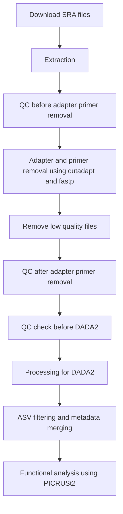

# Microbiome 16S Normal Scalp Analysis Workflow

## Databases
- **Silva version 138.2, 16S** : [https://zenodo.org/records/14169026](https://zenodo.org/records/14169026)

## Git Repository
- Repository: `jwchoi-derm-lab/microbiome-16s-normal-scalp`
- Local clone path: `/media/jwchoi/ssd2/projects/microbiome/16S_1/git/`
- Example commands:
```bash
# Clone repository
git clone git@github.com:jwchoi-derm-lab/microbiome-16s-normal-scalp.git

# Add & commit all files
git add .
git commit -m "Add workflow file"
git push origin main
```

## Workflow Overview



---

## Step 1: Downloading & Extracting SRA Files
- Metadata: `/media/jwchoi/ssd2/projects/microbiome/16S_1/metadata/scalp_16s.csv`
- Scripts:
```bash
sh scripts/01_16s_01_download_sra.sh
bash scripts/02_16s_01_extraction_sra.sh
python scripts/02_16s_01_single_end_name_change.py
```

---

## Step 2: Quality Control
- FastQC + MultiQC
- Separate single-end / paired-end files
```bash
bash scripts/03_16s_01_fastqc_multiqc.sh
```

---

## Step 3: Adapter & Primer Removal
- Detect adapters (fastp)
- Remove primers (cutadapt)
- Organize files by BioProject
```bash
python scripts/05_16s_01_cutadapt_prep*.py
python scripts/05_16s_01_cutadapt.py
```

---

## Step 4: DADA2 Processing
- Determine trimming positions
- Generate ASVs
- Filter ASVs (remove singletons, low-abundance)
- Taxonomy assignment
- Phyloseq objects
```bash
python scripts/06_16s_01_set_trimming_1.py
Rscript scripts/06_DADA2_For_R_*.R
```

---

## Step 5: ASV Filtering & Metadata Merging
- Species / Genus level filtering
- Metadata merging
- Overview by BioProject / genus
```bash
Rscript scripts/06_01_asv_filter_16s_genus_species.R
Rscript scripts/06_02_16s_p.obj_metadata_merging.R
Rscript scripts/06_03_16s_overview_profile_bioproj_genus.R
```

---

## Step 6: Functional Analysis (PICRUSt2)
```bash
conda activate picrust2
picrust2_pipeline.py -s ASV_filtered_all.fasta -i ASV_filtered_all.biom -o picrust2_out -p 4
add_descriptions.py -i path_abun_unstrat.tsv -o path_abun_unstrat_descrip.tsv --map_type metacyc
Rscript scripts/07_02_picrust2_analysis.R
```

---

## Step 7: Outputs
- QC Reports: `/qc`, `/qc_tr`, `/qc_tr_1`
- ASVs: `/dada2_results`
- Taxonomy mapping: `/dada2_results/taxo_phyloseq`
- Functional pathways: `/dada2_results/picrust2_input_merged/picrust2_out/pathways_out`

---

💡 **Markdown 특징**
- 제목(`#`)과 목록(`-`/`1.`)으로 깔끔하게 정리
- 코드블록(````bash```)으로 명령어 구분
- ASCII / Mermaid 플로우차트 포함 → 전체 워크플로우 한눈에 확인
- 스크립트 경로 및 출력 폴더 명시 → 협업 시 참고 가능
